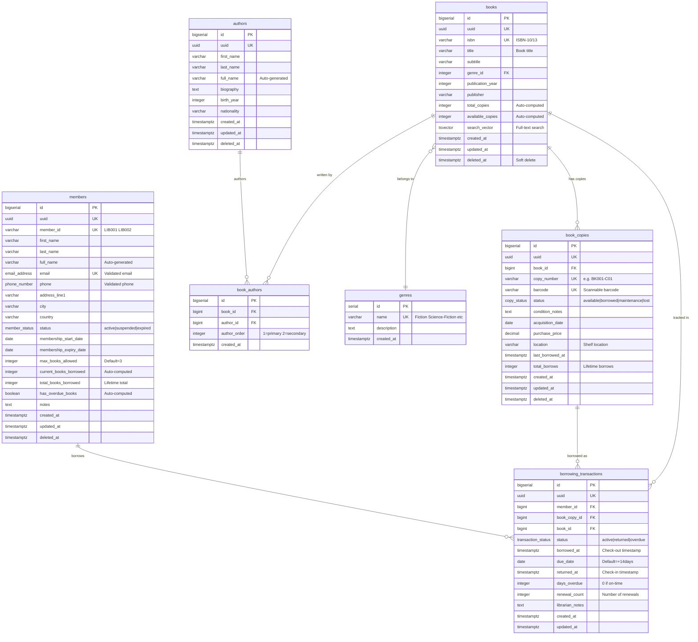

# Library Management System - Entity Relationship Diagram

## Database Schema Visualization

---

## Simplified Relationship View

---

## Data Flow: Borrowing Process

---

## Key Relationships Summary

| Parent Table | Child Table | Relationship | Description |
|--------------|-------------|--------------|-------------|
| **genres** | books | 1:Many | Each book belongs to one genre |
| **books** | book_copies | 1:Many | One book can have multiple physical copies |
| **books** | book_authors | 1:Many | Books can have multiple authors |
| **authors** | book_authors | 1:Many | Authors can write multiple books |
| **book_copies** | borrowing_transactions | 1:Many | Track each copy's borrowing history |
| **members** | borrowing_transactions | 1:Many | Members can have multiple borrows |
| **books** | borrowing_transactions | 1:Many | Track which books are borrowed (denormalized) |

---

## Business Rules Enforced

### 🔒 Constraints (Database Level)
1. **Max 3 books per member** - Enforced by trigger
2. **No borrowing with overdue books** - Enforced by trigger
3. **Copy must be available** - Enforced by trigger
4. **14-day default loan period** - Auto-set by trigger
5. **ISBN uniqueness** - Unique constraint
6. **Copy number uniqueness** - Unique across entire library
7. **Email validation** - Custom domain type
8. **Phone validation** - Custom domain type

### ⚙️ Automatic Updates (Triggers)
1. **Book.total_copies** - Updated when copies added/removed
2. **Book.available_copies** - Updated when copy status changes
3. **Member.current_books_borrowed** - Updated on borrow/return
4. **Member.has_overdue_books** - Updated daily
5. **BookCopy.status** - Auto-changed on borrow/return
6. **updated_at timestamps** - Auto-updated on all tables

---

## Statistics & Reporting Views

### Materialized Views (Refresh Daily)
1. **popular_books_stats** - Top books by week/month/year
2. **genre_popularity_stats** - Genre borrowing trends
3. **member_activity_stats** - Daily activity metrics

### Real-time Views
1. **overdue_books_current** - Active overdue books with member contact
2. **books_availability** - Book catalog with availability and authors
3. **member_borrowing_summary** - Member status and limits

---

## Database Statistics

| Entity | Count | Notes |
|--------|-------|-------|
| **Tables** | 9 | Core + audit + migrations |
| **Views** | 3 | Real-time queries |
| **Materialized Views** | 3 | Pre-computed statistics |
| **Functions** | 7 | Business logic helpers |
| **Triggers** | 11 | Automatic data management |
| **Indexes** | 27+ | Performance optimization |
| **Custom Types** | 3 | ENUMs for status fields |
| **Custom Domains** | 3 | Email, phone, ISBN validation |

---

## Color Legend for Diagrams

- 🔵 **Blue** - Reference/Lookup tables (genres, authors)
- 🔴 **Red** - Core business entities (books, book_copies)
- 🟢 **Green** - User entities (members)
- 🟡 **Yellow** - Transactional data (borrowing_transactions)
- ⚪ **Gray** - Junction/Support tables (book_authors, audit_logs)
