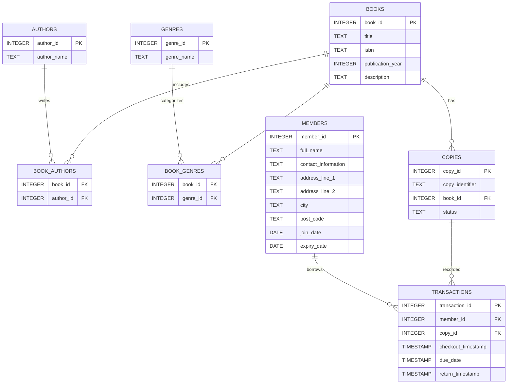

# Database Schema ER Diagram

```mermaid
erDiagram
    AUTHORS {
        INTEGER author_id PK
        TEXT author_name
    }

    GENRES {
        INTEGER genre_id PK
        TEXT genre_name
    }

    BOOKS {
        INTEGER book_id PK
        TEXT title
        TEXT isbn
        INTEGER publication_year
        TEXT description
    }

    BOOK_AUTHORS {
        INTEGER book_id FK
        INTEGER author_id FK
    }

    BOOK_GENRES {
        INTEGER book_id FK
        INTEGER genre_id FK
    }

    MEMBERS {
        INTEGER member_id PK
        TEXT full_name
        TEXT contact_information
        TEXT address_line_1
        TEXT address_line_2
        TEXT city
        TEXT post_code
        DATE join_date
        DATE expiry_date
    }

    COPIES {
        INTEGER copy_id PK
        TEXT copy_identifier
        INTEGER book_id FK
        TEXT status
    }

    TRANSACTIONS {
        INTEGER transaction_id PK
        INTEGER member_id FK
        INTEGER copy_id FK
        TIMESTAMP checkout_timestamp
        TIMESTAMP due_date
        TIMESTAMP return_timestamp
    }

    AUTHORS ||--o{ BOOK_AUTHORS : writes
    BOOKS ||--o{ BOOK_AUTHORS : includes

    GENRES ||--o{ BOOK_GENRES : categorizes
    BOOKS ||--o{ BOOK_GENRES : tagged

    BOOKS ||--o{ COPIES : has
    MEMBERS ||--o{ TRANSACTIONS : borrows
    COPIES ||--o{ TRANSACTIONS : recorded
```
